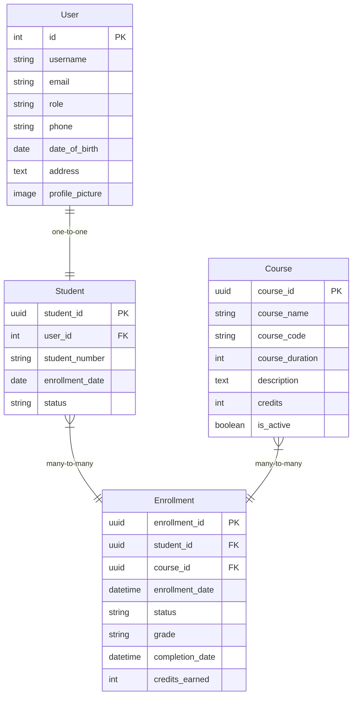

# 🎓 Student Course Management System (SCIQUS)

A comprehensive full-stack web application for managing students, courses, and enrollments built with **Django REST Framework** (backend) and **React** (frontend). This system provides role-based access control with separate interfaces for administrators and students.

## � Table of Contents

1. [📸 Project Screenshots](#-project-screenshots)
2. [🏗️ Project Structure](#️-project-structure)
3. [🗄️ Database Schema](#️-database-schema)
4. [🎯 Key Features](#-key-features)
5. [🚀 Quick Start](#-quick-start)
6. [🔧 Configuration](#-configuration)
7. [🔌 API Documentation](#-api-documentation)
8. [📱 Frontend Architecture](#-frontend-architecture)
9. [� Default Credentials](#-default-credentials)
10. [📈 Future Enhancements](#-future-enhancements)
11. [🛠️ Dependencies & Requirements](#️-dependencies--requirements)
12. [🤝 Contributing](#-contributing)
13. [📄 License](#-license)
14. [📞 Support & Contact](#-support--contact)

## �📸 Project Screenshots


## 🏗️ Project Structure

```
SCIQUS_PROJECT/
├── 📁 authentication/          # User authentication & authorization
│   ├── __init__.py
│   ├── admin.py               # Admin interface configuration
│   ├── apps.py                # App configuration
│   ├── models.py              # Custom User model
│   ├── serializers.py         # API serializers
│   ├── urls.py                # URL patterns
│   ├── views.py               # API views
│   └── migrations/            # Database migrations
│
├── 📁 courses/                # Course management
│   ├── __init__.py
│   ├── admin.py               # Course admin interface
│   ├── apps.py
│   ├── models.py              # Course model
│   ├── permissions.py         # Custom permissions
│   ├── serializers.py         # Course serializers
│   ├── urls.py
│   ├── views.py               # Course API views
│   └── migrations/
│
├── 📁 students/               # Student management
│   ├── __init__.py
│   ├── admin.py               # Student admin interface
│   ├── apps.py
│   ├── models.py              # Student & Enrollment models
│   ├── serializers.py         # Student serializers
│   ├── signals.py             # Model signals
│   ├── urls.py
│   ├── utils.py               # Utility functions
│   ├── views.py               # Student API views
│   ├── management/            # Custom management commands
│   └── migrations/
│
├── 📁 student_course_management/  # Django project settings
│   ├── __init__.py
│   ├── asgi.py                # ASGI configuration
│   ├── settings.py            # Project settings
│   ├── urls.py                # Main URL configuration
│   └── wsgi.py                # WSGI configuration
│
├── 📁 frontend/               # React frontend
│   ├── 📁 public/             # Static assets
│   ├── 📁 src/
│   │   ├── 📁 components/     # Reusable React components
│   │   ├── 📁 pages/          # Page components
│   │   ├── 📁 contexts/       # React contexts
│   │   ├── 📁 hooks/          # Custom hooks
│   │   ├── 📁 services/       # API services
│   │   ├── 📁 utils/          # Utility functions
│   │   ├── App.js             # Main App component
│   │   └── index.js           # Entry point
│   ├── package.json           # Dependencies
│   ├── tailwind.config.js     # Tailwind CSS config
│   └── postcss.config.js      # PostCSS config
│
├── 📁 Project Screenshots/    # Application screenshots
├── 📁 .venv/                  # Virtual environment
├── 📄 manage.py               # Django management script
├── 📄 requirements.txt        # Python dependencies
├── 📄 .env                    # Environment variables
├── 📄 .gitignore             # Git ignore file
└── 📄 README.md               # This file
```

## 🗄️ Database Schema

### Core Models

#### 1. User Model (Custom Authentication)

```python
class User(AbstractUser):
    """Extended user model with role-based access"""

    # Fields
    role = CharField(choices=['admin', 'student'])  # User role
    phone = CharField(max_length=15)                # Contact number
    date_of_birth = DateField()                     # Birth date
    address = TextField()                           # Address
    profile_picture = ImageField()                  # Profile image
    created_at = DateTimeField(auto_now_add=True)
    updated_at = DateTimeField(auto_now=True)

    # Properties
    @property
    def is_admin(self) -> bool
    @property
    def is_student(self) -> bool
```

#### 2. Course Model

```python
class Course(models.Model):
    """Course information and management"""

    # Fields
    course_id = UUIDField(primary_key=True)         # Unique identifier
    course_name = CharField(max_length=255)         # Course name
    course_code = CharField(max_length=20, unique=True)  # Unique code
    course_duration = PositiveIntegerField()        # Duration in months
    description = TextField()                       # Course description
    credits = PositiveIntegerField(default=3)       # Credit hours
    is_active = BooleanField(default=True)          # Active status
    created_at = DateTimeField(auto_now_add=True)
    updated_at = DateTimeField(auto_now=True)

    # Properties
    @property
    def enrolled_students_count(self) -> int
```

#### 3. Student Model

```python
class Student(models.Model):
    """Student profile and information"""

    # Fields
    student_id = UUIDField(primary_key=True)        # Unique identifier
    user = OneToOneField(User)                      # Link to User
    student_number = CharField(unique=True)         # Student ID number
    courses = ManyToManyField(Course, through='Enrollment')  # Enrolled courses
    enrollment_date = DateField()                   # First enrollment date
    status = CharField(choices=STATUS_CHOICES)      # Student status
    created_at = DateTimeField(auto_now_add=True)
    updated_at = DateTimeField(auto_now=True)

    # Methods
    def enroll_in_course(self, course)
    def unenroll_from_course(self, course)
    def is_enrolled_in_course(self, course) -> bool

    # Properties
    @property
    def full_name(self) -> str
    @property
    def active_enrollments(self)
    @property
    def active_courses(self)
```

#### 4. Enrollment Model (Through Model)

```python
class Enrollment(models.Model):
    """Student-Course enrollment relationship"""

    # Fields
    enrollment_id = UUIDField(primary_key=True)     # Unique identifier
    student = ForeignKey(Student)                   # Enrolled student
    course = ForeignKey(Course)                     # Enrolled course
    enrollment_date = DateTimeField()               # Enrollment date
    status = CharField(choices=ENROLLMENT_STATUS_CHOICES)  # Status
    grade = CharField(choices=GRADE_CHOICES)        # Final grade
    completion_date = DateTimeField()               # Completion date
    credits_earned = PositiveIntegerField()         # Credits earned
    created_at = DateTimeField(auto_now_add=True)
    updated_at = DateTimeField(auto_now=True)

    # Methods
    def complete_course(self, grade=None)
    def withdraw_from_course(self)

    # Properties
    @property
    def is_active(self) -> bool
    @property
    def is_completed(self) -> bool
```

### Database Relationships



## 🎯 Key Features

### 👨‍💼 Admin Features

- **📊 Dashboard Analytics**: Real-time system statistics and KPIs
- **👥 Student Management**: Complete CRUD operations for student profiles
- **📚 Course Management**: Course creation, editing, and activation/deactivation
- **📝 Enrollment Tracking**: Monitor and manage student enrollments
- **🔍 Advanced Search**: Powerful search and filtering across all entities
- **📈 Reporting**: Comprehensive reports and analytics
- **🔒 Role Management**: User role assignment and permission control

### 🧑‍🎓 Student Features

- **🎯 Personal Dashboard**: Customized dashboard with course progress
- **📚 Course Catalog**: Browse and search available courses
- **✅ Easy Enrollment**: Simple course enrollment process
- **📋 My Courses**: View enrolled courses and progress
- **👤 Profile Management**: Update personal information and settings
- **🔔 Notifications**: Course updates and system notifications
- **📱 Mobile Friendly**: Responsive design for all devices

### 🔒 Security Features

- **🔐 JWT Authentication**: Secure token-based authentication
- **👥 Role-based Access**: Admin and student roles with appropriate permissions
- **🛡️ Password Security**: Strong password requirements and validation
- **🌐 CORS Protection**: Properly configured cross-origin requests
- **✅ Input Validation**: Comprehensive data validation on both ends

## 🚀 Quick Start

### Prerequisites

- **Python 3.8+**
- **Node.js 14+**
- **npm or yarn**
- **Git**

### Backend Setup (Django)

1. **Clone the repository**

   ```bash
   git clone <repository-url>
   cd SCIQUS-Project
   ```

2. **Create virtual environment**

   ```bash
   python -m venv .venv
   .venv\Scripts\activate  # Windows
   # source .venv/bin/activate  # macOS/Linux
   ```

3. **Install dependencies**

   ```bash
   pip install -r requirements.txt
   ```

4. **Setup database**

   ```bash
   python manage.py makemigrations
   python manage.py migrate
   ```

5. **Create admin user**

   ```bash
   python manage.py createsuperuser
   ```

6. **Run server**
   ```bash
   python manage.py runserver
   ```
   Backend available at: `http://127.0.0.1:8000/`

### Frontend Setup (React)

1. **Navigate to frontend**

   ```bash
   cd frontend
   ```

2. **Install dependencies**

   ```bash
   npm install
   ```

3. **Start development server**
   ```bash
   npm start
   ```
   Frontend available at: `http://localhost:3000/`

## 🔧 Configuration

### Environment Variables

Create a `.env` file in the project root:

```env
# Django Settings
SECRET_KEY=your-secret-key-here
DEBUG=True
ALLOWED_HOSTS=localhost,127.0.0.1

# Database Configuration
DB_ENGINE=django.db.backends.mysql
DB_NAME=student_course_db
DB_USER=root
DB_PASSWORD=your-database-password
DB_HOST=localhost
DB_PORT=3306

# JWT Settings
JWT_ACCESS_TOKEN_LIFETIME=60  # minutes
JWT_REFRESH_TOKEN_LIFETIME=7  # days

# CORS Settings
CORS_ALLOWED_ORIGINS=http://localhost:3000,http://127.0.0.1:3000
```

### Django Settings Highlights

```python
# Custom User Model
AUTH_USER_MODEL = 'authentication.User'

# REST Framework Configuration
REST_FRAMEWORK = {
    'DEFAULT_AUTHENTICATION_CLASSES': [
        'rest_framework_simplejwt.authentication.JWTAuthentication',
    ],
    'DEFAULT_PERMISSION_CLASSES': [
        'rest_framework.permissions.IsAuthenticated',
    ],
    'DEFAULT_PAGINATION_CLASS': 'rest_framework.pagination.PageNumberPagination',
    'PAGE_SIZE': 20,
}

# Simple JWT Configuration
SIMPLE_JWT = {
    'ACCESS_TOKEN_LIFETIME': timedelta(minutes=60),
    'REFRESH_TOKEN_LIFETIME': timedelta(days=7),
    'ROTATE_REFRESH_TOKENS': True,
    'BLACKLIST_AFTER_ROTATION': True,
}

# Database Configuration
DATABASES = {
    'default': {
        'ENGINE': 'django.db.backends.mysql',
        'NAME': 'student_course_db',
        'USER': 'root',
        'PASSWORD': 'your-password',
        'HOST': 'localhost',
        'PORT': '3306',
    }
}
```

## 🔌 API Documentation

### Base URL

- **Development**: `http://127.0.0.1:8000/api/`
- **API Root**: `http://127.0.0.1:8000/api/v1/`

### Authentication Endpoints

| Method | Endpoint               | Description          | Payload                                     |
| ------ | ---------------------- | -------------------- | ------------------------------------------- |
| POST   | `/auth/register/`      | User registration    | `username, email, password, role`           |
| POST   | `/auth/login/`         | User login           | `username, password`                        |
| POST   | `/auth/logout/`        | User logout          | `refresh_token`                             |
| POST   | `/auth/token/refresh/` | Refresh access token | `refresh`                                   |
| GET    | `/auth/profile/`       | Get user profile     | -                                           |
| PUT    | `/auth/profile/`       | Update user profile  | `first_name, last_name, email, phone, etc.` |

### Course Management Endpoints

| Method | Endpoint                     | Description        | Permissions   |
| ------ | ---------------------------- | ------------------ | ------------- |
| GET    | `/courses/`                  | List all courses   | Authenticated |
| POST   | `/courses/`                  | Create new course  | Admin only    |
| GET    | `/courses/{id}/`             | Get course details | Authenticated |
| PUT    | `/courses/{id}/`             | Update course      | Admin only    |
| DELETE | `/courses/{id}/`             | Delete course      | Admin only    |
| GET    | `/courses/search/?q={query}` | Search courses     | Authenticated |

### Student Management Endpoints

| Method | Endpoint             | Description            | Permissions  |
| ------ | -------------------- | ---------------------- | ------------ |
| GET    | `/students/`         | List all students      | Admin only   |
| POST   | `/students/`         | Create student profile | Admin only   |
| GET    | `/students/profile/` | Get own profile        | Student only |
| PUT    | `/students/profile/` | Update own profile     | Student only |
| GET    | `/students/{id}/`    | Get student details    | Admin only   |
| PUT    | `/students/{id}/`    | Update student         | Admin only   |
| DELETE | `/students/{id}/`    | Delete student         | Admin only   |

### Enrollment Endpoints

| Method | Endpoint                  | Description            | Permissions  |
| ------ | ------------------------- | ---------------------- | ------------ |
| POST   | `/courses/{id}/enroll/`   | Enroll in course       | Student only |
| DELETE | `/courses/{id}/unenroll/` | Unenroll from course   | Student only |
| GET    | `/students/my-courses/`   | Get enrolled courses   | Student only |
| GET    | `/enrollments/`           | List all enrollments   | Admin only   |
| GET    | `/enrollments/{id}/`      | Get enrollment details | Admin/Owner  |
| PUT    | `/enrollments/{id}/`      | Update enrollment      | Admin only   |

## 📱 Frontend Architecture

### Technology Stack

| Technology          | Version | Purpose                  |
| ------------------- | ------- | ------------------------ |
| **React**           | 18.2.0  | Core UI library          |
| **React Router**    | 6.3.0   | Client-side routing      |
| **Axios**           | 0.27.2  | HTTP client              |
| **Tailwind CSS**    | 3.1.8   | Utility-first CSS        |
| **React Hook Form** | 7.34.0  | Form management          |
| **React Toastify**  | 9.0.8   | Notifications            |
| **Lucide React**    | 0.263.1 | Icon library             |
| **Headless UI**     | 1.6.6   | Accessible UI components |

### Component Architecture

```
src/
├── components/           # Reusable UI components
│   ├── common/          # Common components
│   │   ├── Header.js
│   │   ├── Footer.js
│   │   ├── Sidebar.js
│   │   ├── LoadingSpinner.js
│   │   └── ErrorBoundary.js
│   ├── forms/           # Form components
│   │   ├── LoginForm.js
│   │   ├── CourseForm.js
│   │   └── StudentForm.js
│   └── ui/              # Base UI components
│       ├── Button.js
│       ├── Input.js
│       ├── Modal.js
│       └── Card.js
│
├── pages/               # Page components
│   ├── auth/           # Authentication pages
│   │   ├── LoginPage.js
│   │   └── RegisterPage.js
│   ├── admin/          # Admin pages
│   │   ├── AdminDashboard.js
│   │   ├── AdminCoursesPage.js
│   │   └── AdminStudentsPage.js
│   └── student/        # Student pages
│       ├── StudentDashboard.js
│       ├── CoursesPage.js
│       ├── MyCoursesPage.js
│       └── ProfilePage.js
│
├── contexts/           # React contexts
│   ├── AuthContext.js  # Authentication state
│   └── ThemeContext.js # UI theme state
│
├── hooks/              # Custom hooks
│   ├── useAuth.js      # Authentication hook
│   ├── useApi.js       # API calling hook
│   └── useForm.js      # Form handling hook
│
├── services/           # API services
│   ├── api.js          # Axios configuration
│   ├── authService.js  # Authentication API
│   ├── courseService.js # Course API
│   └── studentService.js # Student API
│
└── utils/              # Utility functions
    ├── constants.js    # App constants
    ├── helpers.js      # Helper functions
    └── validators.js   # Form validators
```

## 🔧 Default Credentials

````

## 🔒 Security Features

### Backend Security

1. **JWT Authentication**

   ```python
   # Token-based authentication with automatic expiration
   SIMPLE_JWT = {
       'ACCESS_TOKEN_LIFETIME': timedelta(minutes=60),
       'REFRESH_TOKEN_LIFETIME': timedelta(days=7),
       'ROTATE_REFRESH_TOKENS': True,
       'BLACKLIST_AFTER_ROTATION': True,
   }
````

2. **Role-Based Access Control**

   ```python
   # Custom permissions for admin/student access
   class IsAdminUser(BasePermission):
       def has_permission(self, request, view):
           return request.user.is_authenticated and request.user.is_admin

   class IsStudentUser(BasePermission):
       def has_permission(self, request, view):
           return request.user.is_authenticated and request.user.is_student
   ```

3. **Input Validation**

   ```python
   # Model-level validation
   def clean(self):
       if self.course_duration <= 0:
           raise ValidationError("Course duration must be greater than 0")

   # Serializer validation
   class CourseSerializer(serializers.ModelSerializer):
       def validate_course_code(self, value):
           if not re.match(r'^[A-Z]{2,3}\d{3}$', value):
               raise serializers.ValidationError("Invalid course code format")
           return value
   ```

4. **CORS Protection**
   ```python
   # Configured CORS for specific origins
   CORS_ALLOWED_ORIGINS = [
       "http://localhost:3000",
       "http://127.0.0.1:3000",
   ]
   CORS_ALLOW_CREDENTIALS = True
   ```

### Frontend Security

1. **Protected Routes**

   ```javascript
   // Route protection based on authentication
   const ProtectedRoute = ({ children }) => {
     const { isAuthenticated } = useAuth();
     return isAuthenticated ? children : <Navigate to="/login" />;
   };
   ```

2. **Token Management**

   ```javascript
   // Secure token storage and automatic refresh
   const refreshToken = async () => {
     try {
       const response = await api.post("/auth/token/refresh/", {
         refresh: localStorage.getItem("refresh_token"),
       });
       localStorage.setItem("access_token", response.data.access);
       return response.data.access;
     } catch (error) {
       logout();
       throw error;
     }
   };
   ```

3. **Form Validation**
   ```javascript
   // Client-side form validation
   const validationSchema = {
     email: {
       required: "Email is required",
       pattern: {
         value: /^[A-Z0-9._%+-]+@[A-Z0-9.-]+\.[A-Z]{2,}$/i,
         message: "Invalid email address",
       },
     },
     password: {
       required: "Password is required",
       minLength: {
         value: 8,
         message: "Password must be at least 8 characters",
       },
     },
   };
   ```

## 🔧 Default Credentials

### Admin Access

- **Username**: `admin`
- **Password**: `admin@1234`
- **Access**: Full system administration

### Student Access

- **Username**: `john` (or create new student account)
- **Password**: `John@1234`
- **Access**: Course enrollment and profile management

## 📈 Future Enhancements

### Phase 1: Core Improvements

- **📧 Email Notifications**: Automated emails for enrollment confirmations, course updates, and deadlines
- **� Push Notifications**: Real-time browser notifications for important updates
- **�📊 Advanced Analytics**: Detailed dashboards with enrollment trends, completion rates, and performance metrics
- **🔍 Enhanced Search**: Full-text search with filters, sorting, and advanced query capabilities
- **📱 Mobile PWA**: Progressive Web App functionality for offline access and mobile optimization

### Phase 2: Academic Features

- **📝 Assignment Management**: Create, submit, and grade assignments within courses
- **🎥 Video Content Integration**: Support for video lectures and multimedia content
- **📚 Learning Resources**: File uploads, reading materials, and resource libraries
- **🏆 Grading System**: Comprehensive grading with rubrics, feedback, and grade books
- **📊 Progress Tracking**: Detailed student progress analytics and learning outcomes

### Phase 3: Advanced Features

- **💬 Real-time Chat**: Course-specific chat rooms and direct messaging
- **👥 Discussion Forums**: Course discussions, Q&A sections, and peer interactions
- **📅 Calendar Integration**: Schedule management, assignment due dates, and event tracking
- **🎯 Gamification**: Achievement badges, leaderboards, and progress rewards
- **🤖 AI Integration**: Intelligent course recommendations and automated assistance

### Phase 4: Enterprise Features

- **🏢 Multi-tenant Architecture**: Support for multiple institutions on single platform
- **� Bulk Operations**: Mass import/export of students, courses, and grades
- **�📱 Mobile Apps**: Native iOS and Android applications
- **🔐 SSO Integration**: Single Sign-On with popular identity providers
- **📊 Advanced Reporting**: Custom reports, data visualization, and business intelligence

### Phase 5: Integration & Scale

- **🌐 Third-party Integrations**: LMS integration, payment gateways, and external tools
- **☁️ Cloud Deployment**: Auto-scaling infrastructure and CDN integration
- **� API Extensions**: GraphQL support and webhook system
- **📈 Performance Optimization**: Caching layers, database optimization, and monitoring
- **🛡️ Enhanced Security**: Two-factor authentication, audit logs, and compliance features

## 📋 Development Roadmap

### Current Version: v1.0.0

- ✅ User authentication and authorization
- ✅ Course management (CRUD operations)
- ✅ Student enrollment system
- ✅ Admin dashboard and student interface
- ✅ Responsive web design
- ✅ RESTful API architecture
- ✅ Basic search functionality

### Upcoming Releases

#### v1.1.0 (Next Quarter)

- 📧 Email notification system
- � Advanced search and filtering
- 📊 Basic analytics dashboard
- �🔔 In-app notifications
- 📱 PWA functionality

#### v1.2.0 (Mid-term)

- 📝 Assignment management
- 📚 Resource library
- 👥 User role extensions
- 📅 Calendar integration
- 🎥 Media content support

#### v2.0.0 (Long-term)

- 💬 Real-time communication
- 🤖 AI-powered features
- 📱 Mobile applications
- 🏢 Multi-tenant support
- � Enterprise security

## 🛠️ Dependencies & Requirements

### Backend Dependencies

```python
# Core Django packages
Django==5.2.5                          # Web framework
djangorestframework==3.15.2            # REST API framework
djangorestframework-simplejwt==5.3.0    # JWT authentication

# Database & ORM
mysqlclient==2.2.6                      # MySQL database adapter

# API & Documentation
django-cors-headers==4.6.0              # CORS handling
django-filter==24.3                     # API filtering
coreapi==2.3.3                         # API documentation
pygments==2.18.0                       # Syntax highlighting
markdown==3.7                          # Markdown support

# Utilities
python-decouple==3.8                    # Environment configuration
python-dateutil==2.9.0.post0           # Date utilities
Pillow==11.0.0                          # Image processing
```

### Frontend Dependencies

```json
{
  "dependencies": {
    "react": "^18.2.0", // Core React library
    "react-dom": "^18.2.0", // React DOM renderer
    "react-router-dom": "^6.3.0", // Client-side routing
    "axios": "^0.27.2", // HTTP client
    "react-hook-form": "^7.34.0", // Form management
    "react-toastify": "^9.0.8", // Toast notifications
    "tailwindcss": "^3.1.8", // Utility-first CSS
    "lucide-react": "^0.263.1", // Icon library
    "@headlessui/react": "^1.6.6" // Accessible UI components
  },
  "devDependencies": {
    "react-scripts": "5.0.1", // Build tools
    "autoprefixer": "^10.4.7", // CSS autoprefixer
    "postcss": "^8.4.14" // CSS post-processor
  }
}
```

### System Requirements

#### Development Environment

- **Python**: 3.8 or higher
- **Node.js**: 14.0 or higher
- **npm**: 6.0 or higher
- **MySQL**: 8.0 or higher (or SQLite for development)
- **Git**: 2.0 or higher

#### Production Environment

- **Server**: Ubuntu 20.04+ / CentOS 8+ / Windows Server 2019+
- **Python**: 3.8+ with virtual environment
- **Database**: MySQL 8.0+ / PostgreSQL 12+
- **Web Server**: Nginx 1.18+ / Apache 2.4+
- **Process Manager**: Gunicorn / uWSGI
- **Memory**: Minimum 2GB RAM (4GB+ recommended)
- **Storage**: Minimum 10GB (50GB+ recommended for production)

#### Browser Compatibility

- **Chrome**: 90+
- **Firefox**: 88+
- **Safari**: 14+
- **Edge**: 90+
- **Mobile Browsers**: iOS Safari 14+, Chrome Mobile 90+

## 🤝 Contributing

### Getting Started

1. **Fork the repository**

   ```bash
   git clone https://github.com/your-username/SCIQUS_PROJECT.git
   cd SCIQUS_PROJECT
   ```

2. **Set up development environment**

   ```bash
   # Backend setup
   python -m venv .venv
   .venv\Scripts\activate  # Windows
   # source .venv/bin/activate  # macOS/Linux
   pip install -r requirements.txt

   # Frontend setup
   cd frontend
   npm install
   ```

3. **Create a feature branch**
   ```bash
      git checkout -b feature/your-feature-name
   ```

## 📄 License

```

### Development Guidelines

#### Code Style

- **Python**: Follow PEP 8 guidelines
- **JavaScript**: Use ESLint configuration provided
- **Git**: Use conventional commit messages

#### Commit Message Format

```

type(scope): description

[optional body]

[optional footer]

````

Examples:

```bash
feat(auth): add password reset functionality
fix(courses): resolve enrollment validation issue
docs(readme): update installation instructions
test(api): add unit tests for course endpoints
````

#### Pull Request Process

1. **Ensure code quality**

   ```bash
   # Run backend tests
   python manage.py test

   # Run frontend tests
   cd frontend && npm test

   # Check code formatting
   black . --check  # Python
   npm run lint     # JavaScript
   ```

2. **Update documentation**

   - Add docstrings to new functions/classes
   - Update README if adding new features
   - Include API documentation updates

3. **Create pull request**
   - Provide clear description of changes
   - Reference related issues
   - Include screenshots for UI changes
   - Ensure CI/CD checks pass

### Issue Reporting

When reporting bugs, please include:

- **Environment details** (OS, Python/Node versions)
- **Steps to reproduce** the issue
- **Expected vs actual behavior**
- **Error messages** and logs
- **Screenshots** if applicable

### Feature Requests

For feature requests, provide:

- **Clear description** of the proposed feature
- **Use case** and business justification
- **Mockups or wireframes** if applicable
- **Implementation suggestions** if you have ideas

## 📄 License

This project is licensed under the MIT License - see the [LICENSE](LICENSE) file for details.

### MIT License Summary

- ✅ Commercial use allowed
- ✅ Modification allowed
- ✅ Distribution allowed
- ✅ Private use allowed
- ❌ Liability protection
- ❌ Warranty provided

## 📞 Support & Contact

### Getting Help

- **� Documentation**: Check this README and code comments
- **🐛 Issues**: [GitHub Issues](https://github.com/Shreyash1903/SCIQUS_PROJECT/issues)
- **💬 Discussions**: [GitHub Discussions](https://github.com/Shreyash1903/SCIQUS_PROJECT/discussions)

### Contact Information

- **📧 Email**: support@sciqus.com
- **🌐 Website**: [sciqus.com](https://sciqus.com)
- **� Social**: [@SCIQUS_Official](https://twitter.com/SCIQUS_Official)

### Quick Links

- **🚀 Live Demo**: [https://sciqus-demo.herokuapp.com](https://sciqus-demo.herokuapp.com)
- **📋 API Docs**: [http://127.0.0.1:8000/api/](http://127.0.0.1:8000/api/)
- **🔧 Admin Panel**: [http://127.0.0.1:8000/admin/](http://127.0.0.1:8000/admin/)
- **📊 Status Page**: [https://status.sciqus.com](https://status.sciqus.com)

---

**Made with ❤️ for educational excellence**

_SCIQUS - Student Course Intelligence & Quality University System_

**⭐ If you found this project helpful, please give it a star!**

---

### Project Statistics


### Technology Badges


